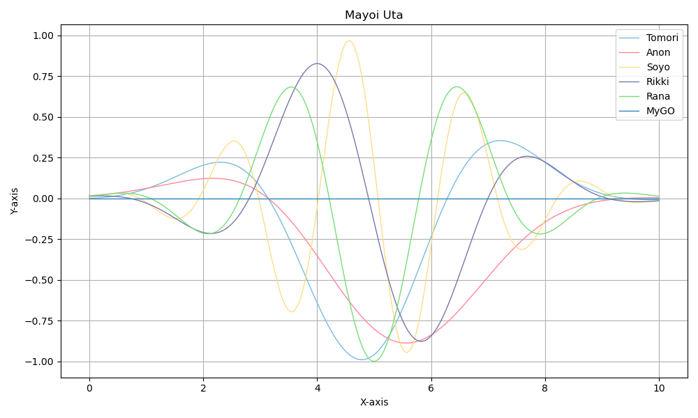

# Girls Band Color

このREADMEファイアはDEEPSEEKで中国語から翻訳しました。

`matplotlib`などの科学作図ツールで各種バンドプロジェクトのカラーパレットをリスペクトしやすいように、配色データを集約したPythonパッケージです。簡単に利用できるカラーデータを提供します。

## インストール
リポジトリをローカルにクローン:
```bash
git clone https://github.com/Weslie0803/GirlsBandColor.git
cd GirlsBandColor
```

環境にパッケージを追加:
```bash
pip install .
```

これでPythonスクリプトやJupyter Notebookなどから呼び出せます。

## 使い方
Pythonでインポート:
```python
import gbcolor
# その他必要なパッケージ
```

保存済みカラーの呼び出し:
```python
tomori = gbcolor.bangdream.mygo.tomori
# その他多数のカラーが利用可能
```

作図でのカラー使用例:
```python
plt.plot(x, line_tomori, color=tomori, label='Tomori', linewidth=1)
```

完全な使用例は `demo.ipynb` を参照:


## カラー一覧

[ここ](colorlist.md)
