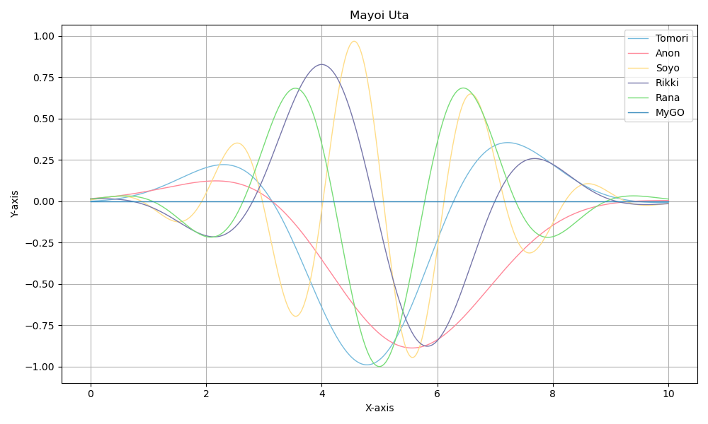

# Girls Band Color

为方便在使用`matplotlib`等工具进行科学作图时致敬各种乐队企划配色，创建了这个python包以汇总各种颜色数据，方便后续调用。

## 安装
将本仓库克隆到本地：
``` bash
git clone https://github.com/Weslie0803/GirlsBandColor.git
cd GirlsBandColor
```

将包添加至环境中：
```bash
pip install .
```

即可在Python脚本或Jupyter Notebook等工具中调用。

## 使用
在Python中import：
``` python
import gbcolor
# 其它需要的包
```

调用存储的颜色：
``` python
tomori = gbcolor.bangdream.mygo.tomori
# 还有很多其它的颜色
```

使用颜色画图：
``` python
plt.plot(x, line_tomori, color=tomori, label='Tomori', linewidth=1)
```

完整实例见`demo.ipynb`：


## 颜色列表

[](colorlist.md)